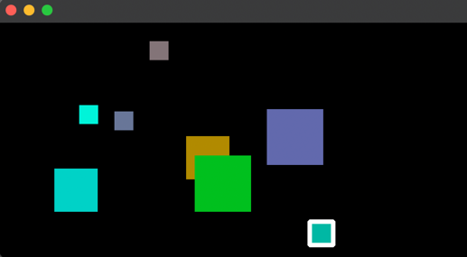
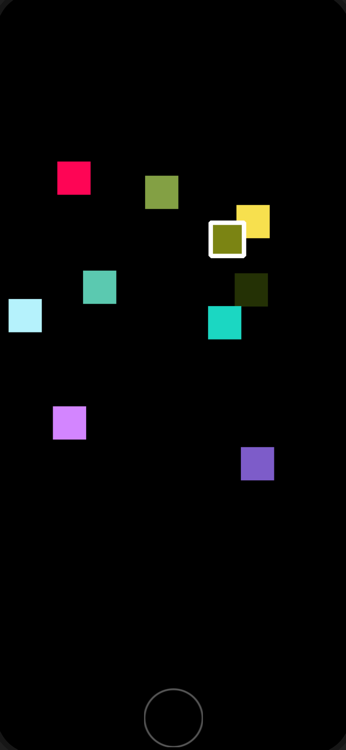

# Square dragging demo app
This is a simple 2D graphics showcase project written in C++ using QT framework. There are 2 targets: iOS & macOS.

After app launches, you will see an empty screen. Tapping or clicking at empty space at the app window at any time will cause a square creation. There is no square deletion functionality in this app. There is no limit of how many squares can be created.

Each square gets a random color when it is created. The size of a new square is equal to 10% of the lesser side of the window. The square you have last interacted with will also have a white border (5px) on top of it. The square you have last interacted with is also being placed on top layer.

If you tap or click at an existing square, you will be able to drag the square around the window. The squares' coordinates are restricted to fit the window's current dimensions.

In case the window is being modified (resize or screen orientation change), a boundaries check will be re-run for every square.

